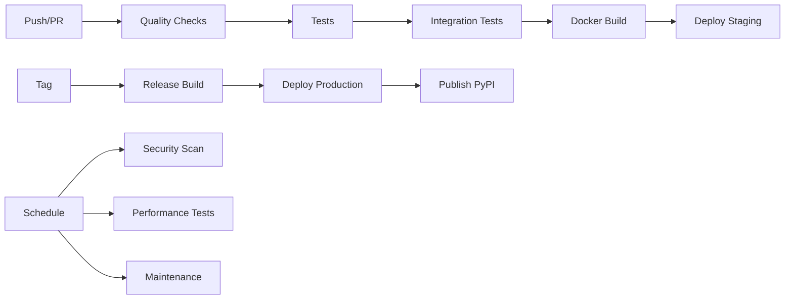

# GitHub Actions Workflows

This directory contains comprehensive CI/CD workflows for the UIR Framework.

## Workflow Overview

### 🔄 CI/CD Pipeline (`ci.yml`)
**Triggers**: Push to main/develop, Pull Requests  
**Features**:
- Code quality checks (Black, isort, Ruff, MyPy)
- Multi-platform testing (Ubuntu, Windows, macOS)
- Multi-version Python support (3.8-3.11)
- Integration tests with services (Redis, PostgreSQL)
- Docker image building and testing
- Performance benchmarking
- Package building and validation
- Automated deployment to staging/production

### 🔒 Security Scanning (`security.yml`)
**Triggers**: Daily schedule, Push to main/develop  
**Features**:
- Dependency vulnerability scanning (Safety, pip-audit)
- Static code analysis (CodeQL, Bandit, Semgrep)
- Container security scanning (Trivy, Docker Scout)
- Secret detection (TruffleHog)
- Automated security reporting

### 📚 Documentation (`docs.yml`)
**Triggers**: Changes to docs/, source files  
**Features**:
- Markdown linting and link checking
- Sphinx documentation building
- OpenAPI spec generation
- Automated GitHub Pages deployment
- README badge updates

### 🚀 Release Management (`release.yml`)
**Triggers**: Git tags (v*)  
**Features**:
- Semantic version validation
- Multi-architecture Docker builds
- GitHub release creation with changelog
- PyPI package publishing
- Automated version bumping
- Release notifications

### ⚡ Performance Testing (`performance.yml`)
**Triggers**: Push to main, Daily schedule  
**Features**:
- Microbenchmarking with pytest-benchmark
- Load testing with Locust
- Memory profiling
- Performance regression detection
- Stress testing for extended periods

### 🔧 Maintenance (`maintenance.yml`)
**Triggers**: Weekly schedule, Manual dispatch  
**Features**:
- Automated dependency updates
- Artifact cleanup
- Security audits
- License compliance checking
- Health checks and package validation
- Maintenance reporting

## Configuration Files

### `dependabot.yml`
- Automated dependency updates
- Python, Docker, and GitHub Actions dependencies
- Weekly schedule with auto-assignment and labeling

### Supporting Files
- `.markdownlint.json` - Markdown linting rules
- `.markdown-link-check.json` - Link validation config

## Required Secrets

For full functionality, configure these secrets in your GitHub repository:

### Container Registries
- `DOCKERHUB_USERNAME` - Docker Hub username
- `DOCKERHUB_TOKEN` - Docker Hub access token

### Package Publishing
- `PYPI_API_TOKEN` - PyPI publishing token
- `TEST_PYPI_API_TOKEN` - Test PyPI token for pre-releases

### Deployment
- `KUBE_CONFIG_STAGING` - Kubernetes config for staging (base64)
- `KUBE_CONFIG_PRODUCTION` - Kubernetes config for production (base64)

### Notifications
- `SLACK_WEBHOOK` - Slack webhook URL for notifications

## Environments

Configure these GitHub environments for deployment:

- **staging** - Staging environment deployment
- **production** - Production environment deployment  
- **pypi** - PyPI package publishing
- **test-pypi** - Test PyPI publishing
- **github-pages** - Documentation hosting

## Workflow Dependencies



## Usage Examples

### Manual Workflow Dispatch
```bash
gh workflow run maintenance.yml
gh workflow run performance.yml --ref main
```

### Creating a Release
```bash
# Tag and push
git tag v1.2.0
git push origin v1.2.0

# This triggers the complete release workflow
```

### Checking Workflow Status
```bash
gh run list --workflow=ci.yml
gh run view <run-id>
```

## Monitoring and Alerts

The workflows include comprehensive monitoring:

- **Performance**: Benchmark results tracked over time
- **Security**: Automated vulnerability reporting
- **Quality**: Code coverage and quality metrics
- **Deployment**: Health checks and rollback capabilities
- **Dependencies**: Automated updates with testing

## Best Practices

1. **Branch Protection**: Enable branch protection rules for main/develop
2. **Required Checks**: Set CI workflows as required for PRs
3. **Secrets Management**: Use environment-specific secrets
4. **Monitoring**: Set up notifications for critical failures
5. **Documentation**: Keep this README updated with changes

## Troubleshooting

### Common Issues

- **Test Failures**: Check the test logs and ensure mocks are properly configured
- **Security Alerts**: Review security scan reports and update dependencies
- **Build Failures**: Verify Docker configuration and dependencies
- **Deployment Issues**: Check Kubernetes configs and secrets

### Getting Help

- Check workflow logs in GitHub Actions tab
- Review the specific workflow documentation
- Open an issue for persistent problems
- Contact the maintainers team