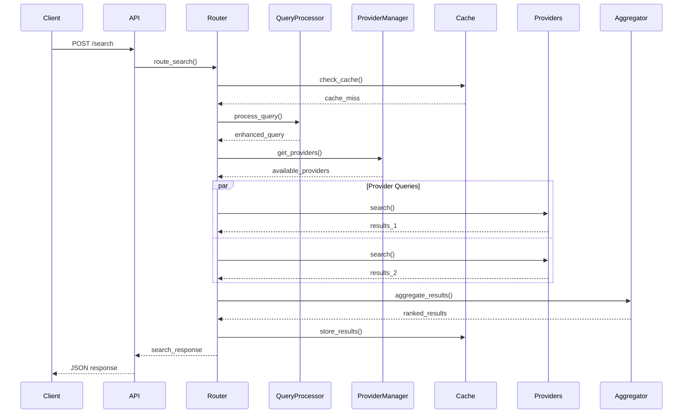
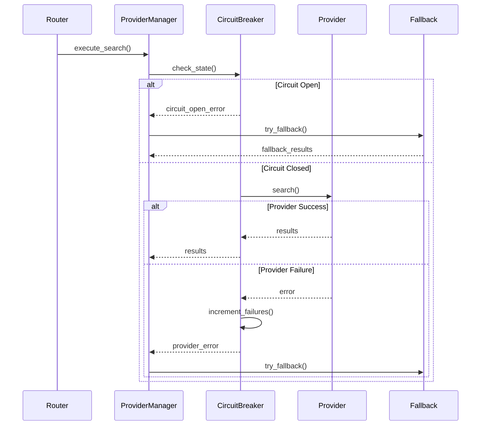

# UIR Framework Architecture

## Overview

The Universal Information Retrieval (UIR) Framework is built on a modular, scalable architecture designed to handle diverse information retrieval providers while maintaining high performance, reliability, and ease of use.

## Architecture Principles

### 1. **Modularity**
- Each component has a single responsibility
- Clear interfaces between components
- Pluggable provider system
- Testable in isolation

### 2. **Scalability**
- Horizontal scaling support
- Async/await throughout
- Connection pooling and resource management
- Efficient result streaming

### 3. **Reliability**
- Circuit breaker pattern for provider failures
- Graceful degradation and fallback mechanisms
- Comprehensive health monitoring
- Error handling and retry logic

### 4. **Performance**
- Multi-tier caching strategy
- Parallel provider queries
- Efficient result aggregation
- Minimal memory footprint

## System Architecture

```
┌─────────────────────────────────────────────────────────────────┐
│                        UIR Framework                            │
└─────────────────────────────────────────────────────────────────┘

┌─────────────────┐  ┌─────────────────┐  ┌─────────────────┐
│   Client SDK    │  │   REST API      │  │   Web UI        │
│                 │  │                 │  │                 │
│ - Python        │  │ - FastAPI       │  │ - React         │
│ - JavaScript    │  │ - OpenAPI       │  │ - Admin Panel   │
│ - Go            │  │ - Auth          │  │ - Monitoring    │
└─────────────────┘  └─────────────────┘  └─────────────────┘
        │                       │                       │
        └───────────────────────┼───────────────────────┘
                                │
        ┌───────────────────────▼───────────────────────┐
        │              Router Service                   │
        │                                               │
        │  ┌─────────────┐ ┌─────────────┐ ┌─────────┐ │
        │  │Query Proc.  │ │ Aggregator  │ │  Cache  │ │
        │  │             │ │             │ │         │ │
        │  │- Spell Check│ │- RRF        │ │- Redis  │ │
        │  │- Entities   │ │- Weighted   │ │- Memory │ │
        │  │- Expansion  │ │- Max Score  │ │- L1/L2  │ │
        │  └─────────────┘ └─────────────┘ └─────────┘ │
        └───────────────────────┼───────────────────────┘
                                │
        ┌───────────────────────▼───────────────────────┐
        │            Provider Manager                   │
        │                                               │
        │  ┌─────────────┐ ┌─────────────┐ ┌─────────┐ │
        │  │Health Mon.  │ │Load Balance │ │Circuit  │ │
        │  │             │ │             │ │Breaker  │ │
        │  │- Heartbeat  │ │- Round Robin│ │- Failure│ │
        │  │- Latency    │ │- Weighted   │ │- Recovery│ │
        │  │- Success %  │ │- Failover   │ │- Metrics│ │
        │  └─────────────┘ └─────────────┘ └─────────┘ │
        └───────────────────────┼───────────────────────┘
                                │
┌───────────────┬───────────────┼───────────────┬───────────────┐
│               │               │               │               │
┌───▼───┐   ┌───▼───┐       ┌───▼───┐       ┌───▼───┐   ┌───▼───┐
│Google │   │ Bing  │       │Pinecone│       │Elastic│   │  ...  │
│Search │   │Search │       │Vector │       │Search │   │ 50+   │
│       │   │       │       │DB     │       │       │   │Providers│
│- REST │   │- REST │       │- gRPC │       │- REST │   │       │
│- Rate │   │- Rate │       │- Auth │       │- HTTP │   │- Plugin│
│- Auth │   │- Auth │       │- SSL  │       │- Auth │   │- Custom│
└───────┘   └───────┘       └───────┘       └───────┘   └───────┘

┌─────────────────────────────────────────────────────────────────┐
│                   Infrastructure Layer                         │
│                                                                 │
│  ┌─────────────┐ ┌─────────────┐ ┌─────────────┐ ┌───────────┐ │
│  │   Redis     │ │PostgreSQL   │ │Prometheus   │ │   Logs    │ │
│  │             │ │             │ │             │ │           │ │
│  │- Cache      │ │- Config     │ │- Metrics    │ │- Structured│ │
│  │- Session    │ │- Users      │ │- Alerts     │ │- Tracing  │ │
│  │- Rate Limit │ │- Audit      │ │- Dashboards│ │- Errors   │ │
│  └─────────────┘ └─────────────┘ └─────────────┘ └───────────┘ │
└─────────────────────────────────────────────────────────────────┘
```

## Core Components

### 1. Router Service
**Responsibility**: Central orchestrator for all search operations

**Key Features**:
- Request routing and validation
- Provider selection and fallback logic
- Result coordination and response building
- Timeout and error handling

**Flow**:
1. Receive search request
2. Validate and authenticate request
3. Process query (spell check, entity extraction)
4. Select optimal providers
5. Execute parallel searches
6. Aggregate and rank results
7. Return unified response

### 2. Query Processor
**Responsibility**: Intelligent query understanding and enhancement

**Components**:
- **Spell Checker**: Corrects common typos and misspellings
- **Entity Extractor**: Identifies dates, locations, organizations, people
- **Intent Classifier**: Determines search intent (informational, navigational, transactional)
- **Query Expander**: Adds synonyms and related terms
- **Filter Generator**: Creates search filters from entities

**Pipeline**:
```
Input Query → Spell Check → Entity Extraction → Intent Classification → Query Expansion → Enhanced Query
```

### 3. Provider Manager
**Responsibility**: Lifecycle management of search providers

**Features**:
- **Health Monitoring**: Continuous health checks and latency tracking
- **Load Balancing**: Distributes requests across healthy providers
- **Circuit Breaker**: Prevents cascade failures
- **Failover**: Automatic switching to backup providers
- **Configuration**: Dynamic provider configuration updates

**Health States**:
- `healthy`: Normal operation (latency < threshold, success rate > 95%)
- `degraded`: Reduced capacity (latency elevated, success rate > 80%)
- `unhealthy`: Not operational (high failure rate or timeout)

### 4. Result Aggregator
**Responsibility**: Intelligent result fusion and ranking

**Fusion Algorithms**:

#### Reciprocal Rank Fusion (RRF)
```python
score = sum(1 / (k + rank_i)) for all result lists
```
Best for: Combining results from different search strategies

#### Weighted Sum
```python
score = sum(weight_i * score_i) for each provider
```
Best for: When provider quality is known

#### Max Score
```python
score = max(score_i) for each unique result
```
Best for: Preserving highest confidence scores

**Features**:
- Duplicate detection and merging
- Score normalization across providers
- Relevance-based reranking
- Diversity injection

### 5. Cache Manager
**Responsibility**: Multi-tier caching for performance optimization

**Cache Levels**:
1. **L1 Cache (Memory)**: Ultra-fast in-memory cache for frequent queries
2. **L2 Cache (Redis)**: Distributed cache for shared results
3. **Provider Cache**: Provider-specific caching strategies

**Cache Strategies**:
- **TTL-based**: Time-based expiration
- **LRU**: Least Recently Used eviction
- **Size-based**: Memory pressure eviction
- **Invalidation**: Smart cache invalidation on updates

**Cache Keys**:
```
uir:v1:{provider}:{query_hash}:{options_hash}
```

### 6. Authentication & Authorization
**Responsibility**: Secure access control and usage tracking

**Features**:
- **JWT Authentication**: Stateless token-based auth
- **API Key Management**: Per-client API keys
- **Role-Based Access Control (RBAC)**: Granular permissions
- **Rate Limiting**: Configurable rate limits per user/API key
- **Usage Tracking**: Detailed usage analytics

**Permissions**:
- `search`: Basic text search
- `vector_search`: Semantic/vector search
- `hybrid_search`: Hybrid search strategies
- `admin`: Administrative operations
- `rag`: RAG-optimized retrieval

## Provider Architecture

### Provider Adapter Pattern

Each provider implements a common interface:

```python
class ProviderAdapter:
    async def search(self, query: str, options: Dict) -> List[SearchResult]
    async def vector_search(self, vector: List[float], options: Dict) -> List[SearchResult]
    async def index(self, documents: List[Dict], options: Dict) -> Dict
    async def health_check(self) -> ProviderHealth
    
    def transform_request(self, request: Dict) -> Dict
    def transform_response(self, response: Dict) -> List[SearchResult]
```

### Provider Types

#### Search Engines
- **Google Custom Search**: Web search with custom search engines
- **Bing Search API**: Microsoft's search with filters and ranking
- **DuckDuckGo**: Privacy-focused search
- **Brave Search**: Independent search index

#### Vector Databases
- **Pinecone**: Managed vector database with high performance
- **Weaviate**: Open-source vector search with ML models
- **Qdrant**: High-performance vector similarity engine
- **Milvus**: Scalable vector database for AI applications

#### Document Stores
- **Elasticsearch**: Full-text search and analytics engine
- **OpenSearch**: Open-source Elasticsearch alternative
- **MongoDB Atlas Search**: Integrated search for MongoDB
- **PostgreSQL**: Full-text search with pgvector extension

#### Knowledge Graphs
- **Neo4j**: Graph database with Cypher queries
- **Amazon Neptune**: Managed graph database
- **ArangoDB**: Multi-model database with graph support

## Data Flow

### Search Request Flow



### Error Handling Flow



## Scalability Considerations

### Horizontal Scaling
- **Stateless Services**: All services are stateless for easy scaling
- **Load Balancing**: Round-robin and weighted load balancing
- **Auto-scaling**: Kubernetes HPA based on CPU/memory/custom metrics
- **Connection Pooling**: Efficient connection reuse

### Performance Optimization
- **Async I/O**: Non-blocking operations throughout
- **Connection Pooling**: Reuse HTTP connections to providers
- **Batch Operations**: Group multiple requests for efficiency
- **Result Streaming**: Stream results as they arrive

### Caching Strategy
- **Query Caching**: Cache frequent query results
- **Provider Response Caching**: Cache provider-specific responses
- **Negative Caching**: Cache failed requests to avoid retries
- **Cache Warming**: Pre-populate cache with popular queries

## Security Architecture

### Authentication Flow
1. Client obtains JWT token or API key
2. Token/key validated on each request
3. Rate limiting applied based on client identity
4. Request authorized based on client permissions

### Data Security
- **TLS Encryption**: All communications encrypted in transit
- **API Key Security**: Hashed storage, secure transmission
- **Input Validation**: All inputs validated and sanitized
- **Output Filtering**: Sensitive data filtered from responses

### Provider Security
- **Credential Management**: Secure storage of provider credentials
- **Network Security**: VPC/firewall restrictions for provider access
- **Audit Logging**: Complete audit trail of all operations

## Monitoring and Observability

### Metrics
- **Request Metrics**: Latency, throughput, error rates
- **Provider Metrics**: Health, response times, success rates  
- **Cache Metrics**: Hit rates, eviction rates, memory usage
- **Business Metrics**: Query patterns, popular providers, user behavior

### Logging
- **Structured Logging**: JSON-formatted logs with correlation IDs
- **Log Levels**: DEBUG, INFO, WARN, ERROR with appropriate filtering
- **Distributed Tracing**: OpenTelemetry integration for request tracing
- **Security Logs**: Authentication, authorization, and security events

### Health Checks
- **Liveness Probe**: Basic service health
- **Readiness Probe**: Service ready to handle requests
- **Provider Health**: Individual provider status monitoring
- **Dependency Health**: Database, cache, and external service health

## Configuration Management

### Environment-Based Config
```yaml
# Production
providers:
  google:
    enabled: true
    rate_limit: 1000
    timeout_ms: 5000
    circuit_breaker:
      failure_threshold: 5
      recovery_timeout: 60

# Development  
providers:
  google:
    enabled: false  # Use mocks
    
mocks:
  enabled: true
```

### Dynamic Configuration
- **Hot Reloading**: Configuration updates without restart
- **Feature Flags**: Enable/disable features dynamically
- **A/B Testing**: Route percentage of traffic to experimental features
- **Circuit Breaker Tuning**: Adjust thresholds based on provider performance

This architecture ensures the UIR Framework can handle enterprise-scale workloads while maintaining simplicity for developers and operators.